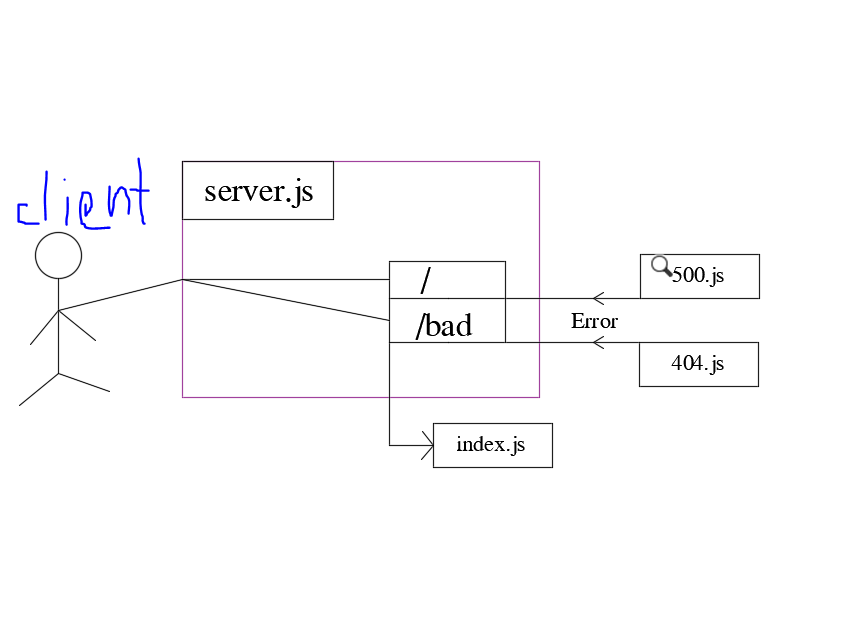

# server-deployment-practice

## Dev
[dev heroku](https://boodah96-server-deploy-dev.herokuapp.com/)

## main
[Main Heroku](https://boodah96-server-deploy-prod.herokuapp.com/)

If you want to install this app=>
 -Clone the repo from git hub
- npm init -y".
- npm i express dotenv supertest jest.

- Create .env file and PORT inside it.

- to test 
Just run `npm test`

UML diagram
